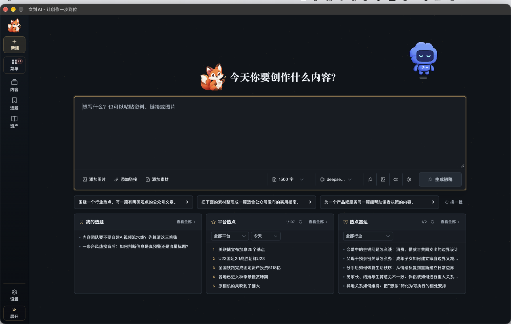
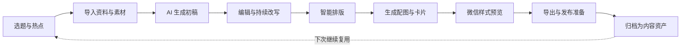

# 文到 AI（Content Workbench）

## 免费的本地 AI 内容创作工作台

**不收会员费，不收订阅费，不按功能分级。**

从选题、写作、改稿，到配图、排版、卡片制作和发布准备，一个桌面应用完成整套内容生产流程。数据默认保存在你的电脑上，AI 服务和模型由你自己选择。

> 文到 AI 软件本身免费使用。调用 AI 时，模型或中转服务是否收费、如何计费，由你选择的服务商决定。

## 为什么选择文到 AI

| 免费使用 | 本地优先 | 一站式创作 | 模型自由 |
| --- | --- | --- | --- |
| 无会员、无订阅、无功能分级 | 内容和运行数据默认保存在本机 | 从灵感到发布准备无需来回切换工具 | 自行配置 AI 服务，不绑定单一厂商 |

文到 AI 面向公众号创作者、内容运营人员和小型内容团队。它不是只有一个输入框的 AI 写作工具，而是一套真正能把内容做完的桌面工作台。

## 从一个想法到可发布内容

1. **找到方向**：从自建选题、平台热点或灵感开始，不再对着空白页面发愁。
2. **交给 AI 起稿**：输入主题，也可以加入文字、链接、图片、知识库和产品资料。
3. **把文章改到满意**：继续对话、调整结构、优化标题并保留内容版本。
4. **一次完成图文包装**：智能排版、生成文章配图，还能制作多页传播卡片。
5. **预览并准备发布**：检查公众号样式，整理账号、计划和最终交付内容。
6. **沉淀自己的资产**：文章、系列、图片和素材留在工作台里，下一次直接复用。

## 核心能力

| 创作环节 | 能力 |
| --- | --- |
| 灵感与选题 | 汇集自建选题、平台热点和创作灵感，一键进入创作 |
| AI 写作与改稿 | 根据主题和素材生成初稿，通过对话持续修改、扩写和重构 |
| 公众号编辑 | Markdown 写作、版本修订、智能排版和微信样式预览 |
| 图片生成 | 管理提示词、生成任务和图片结果，快速准备文章配图 |
| 卡片工坊 | 把文章内容整理为适合社交媒体传播的多页图文卡片 |
| 营销创作 | 围绕产品、受众和营销目标组织专项内容 |
| 本地内容库 | 统一管理文章、系列、知识、产品资料、图片和其他素材 |
| 发布准备 | 管理发布计划、账号信息和内容交付状态 |

## 免费，但不拿你的内容换钱

- **软件免费**：无需购买会员或订阅，不设置付费功能墙。
- **数据在本地**：日常内容、配置和运行数据默认保存在你的电脑上。
- **模型自己选**：可接入你需要的 AI 服务，自行掌握费用、额度和隐私策略。
- **桌面应用**：基于 Wails 构建，面向 Windows、macOS 和 Linux。
- **闭源发布**：本仓库只用于产品介绍、版本公告和公开资料发布，不包含业务源码。

## 适合哪些创作需求

### 免费公众号 AI 写作工具

从选题或资料生成公众号文章初稿，并通过多轮对话继续修改标题、结构和正文。文到 AI 软件本身不收会员费或订阅费，AI 模型费用由你选择的服务商决定。

### 微信公众号排版工具

在同一个桌面工作台中完成 Markdown 编辑、智能排版和微信样式预览，减少在写作工具与在线排版网站之间反复复制。

### 本地 AI 写作软件

文章、配置和运行数据默认保存在本机。你可以自行配置 AI 服务和模型，不必把完整内容库托管到第三方在线编辑器。

### AI 文章配图与图文卡片工具

围绕文章生成配图，并把长内容整理为适合社交媒体传播的多页图文卡片，让正文、图片和传播素材保持在同一条创作流程中。

## 获取与体验

桌面安装包和新版本将在本仓库的 [Releases](https://github.com/wendaoai/wendao-content-workbench/releases) 发布。当前尚未发布公开安装包，可以先关注仓库获取后续更新。

## 反馈

欢迎通过 [Issues](https://github.com/wendaoai/wendao-content-workbench/issues) 提交建议和问题。请勿在 Issue 中发布 API Key、账号凭据、私人内容或其他敏感信息。

---

文到 AI 为闭源软件。本仓库中的文字、图片和品牌素材保留全部权利。

Copyright (c) 2026 Content Workbench. All rights reserved.
