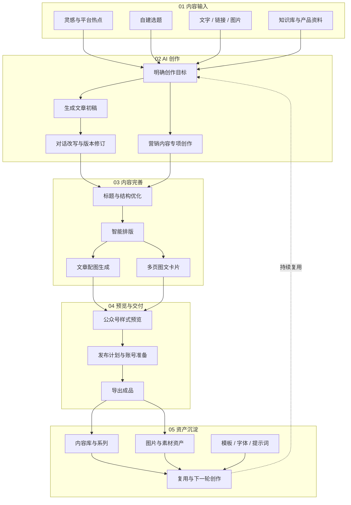

# 文到 AI（Content Workbench）

> 面向中文内容创作者的本地 AI 创作工作台，把选题、写作、配图、排版、资产管理和发布准备放进一个桌面应用。

## 产品简介

文到 AI 为公众号创作者、内容运营人员和小型内容团队提供一套连贯的桌面创作流程。用户可以从灵感和选题出发，调用自己配置的 AI 服务完成文章创作、改写、配图与排版，并在本地管理内容、知识、素材和发布计划。

产品以桌面应用交付，数据默认保存在用户本机。无需把日常内容库托管到第三方在线编辑器中，也不要求用户使用命令行工具。

## 核心能力

| 模块 | 能力 |
| --- | --- |
| AI 创作 | 从主题、素材或已有草稿生成和改写内容，支持持续迭代 |
| 公众号编辑 | Markdown 写作、微信样式预览、智能排版与版本修订 |
| 灵感与选题 | 汇集灵感、热点和选题，形成可继续创作的内容入口 |
| 图片生成 | 管理提示词、生成任务和图片结果，为文章快速准备配图 |
| 卡片工坊 | 将内容整理为适合社交媒体传播的多页图文卡片 |
| 营销创作 | 围绕产品与营销目标组织内容生成流程 |
| 资产中心 | 统一管理知识库、产品资料、图片和其他创作素材 |
| 系列与内容库 | 用系列组织长期栏目，集中管理文章和历史内容 |
| 发布准备 | 管理发布计划、账号信息和内容交付状态 |
| 资源中心 | 获取并管理提示词、字体、模板等公开创作资源 |

## 一站式创作流程

文到 AI 不是单一的 AI 写作框，而是一套从内容需求到发布交付、再回到资产沉淀的完整闭环：

| 阶段 | 在工作台里完成什么 | 产出 |
| --- | --- | --- |
| 1. 内容输入 | 从热点、自建选题、资料、链接、图片或知识库开始 | 清晰的创作任务与素材上下文 |
| 2. AI 创作 | 生成初稿、持续改写，也可进入营销专项流程 | 可继续编辑的文章草稿 |
| 3. 内容完善 | 优化标题结构、智能排版、生成配图和传播卡片 | 图文完整的发布版本 |
| 4. 预览交付 | 检查公众号样式，安排账号、计划和导出 | 可交付、可发布的内容包 |
| 5. 资产沉淀 | 归档内容、系列、图片、模板和提示词 | 可持续复用的本地内容资产 |

## 界面预览

### 创作首页

从一个主题、一段资料、链接或图片直接开始，也可以从选题和热点进入创作。

### 资源中心

最新版桌面端采用紧凑的深色工作台布局，可在应用内浏览和安装字体、纸张背景、纸面光效与装饰素材。

## 产品特点

- **本地优先**：内容、配置和运行数据默认保存在本机。
- **模型可配置**：在应用设置中接入所需 AI 服务，不绑定单一模型供应商。
- **完整创作链路**：从选题到成稿、配图、排版和发布准备，减少工具来回切换。
- **桌面应用**：基于 Wails 构建，提供 Windows、macOS 和 Linux 桌面版本。
- **内容资产沉淀**：文章、系列、知识和素材在同一工作台中持续积累。

## 获取与体验

文到 AI 当前以桌面发行包交付。体验、合作或版本获取方式将在本仓库的 Releases 和公告中更新。

## 源码说明

本仓库仅用于产品介绍、版本公告和公开资料发布，不包含文到 AI 的业务源码、构建脚本、数据库或私有配置。

文到 AI 为闭源软件。仓库中的文字、图片和品牌素材保留全部权利，未经授权不得复制、修改或用于其他产品宣传。

## 联系与反馈

可以通过本仓库的 Issues 提交产品建议和问题反馈。请勿在 Issue 中发布 API Key、账号凭据、私人内容或其他敏感信息。

---

Copyright (c) 2026 Content Workbench. All rights reserved.
